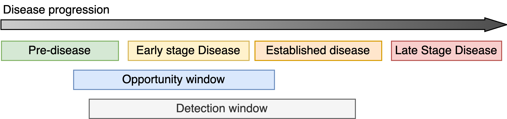
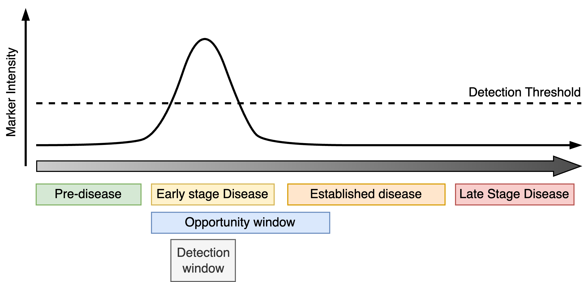
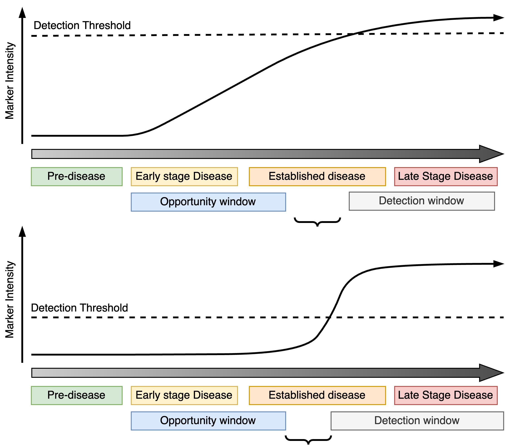
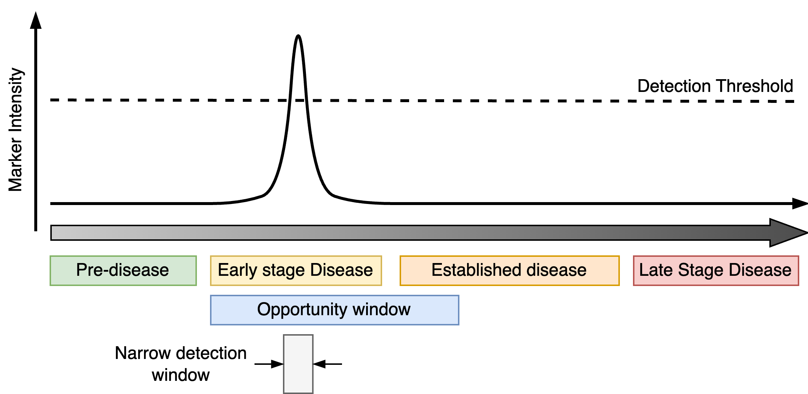
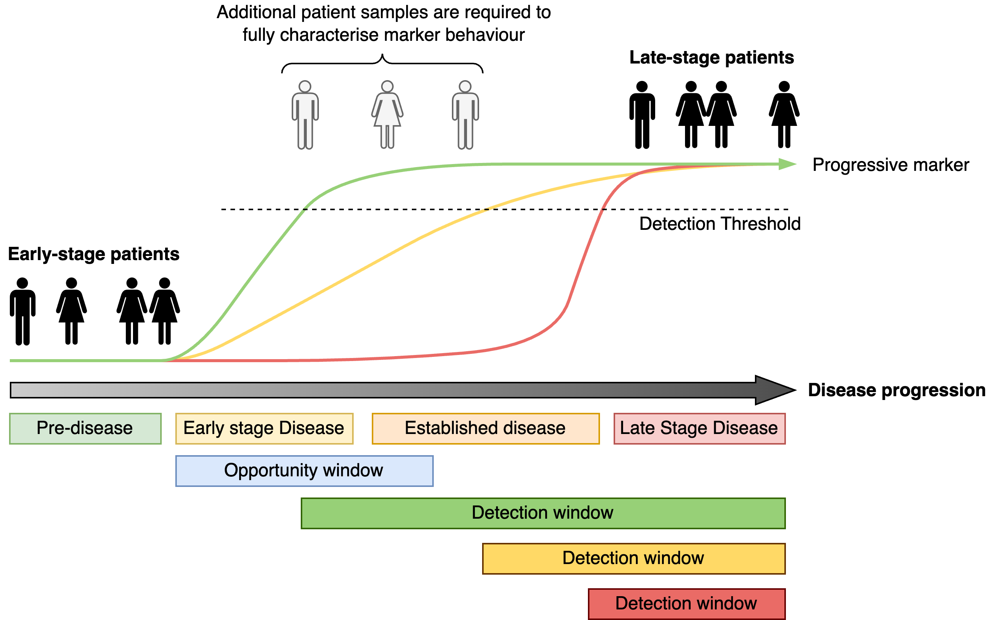
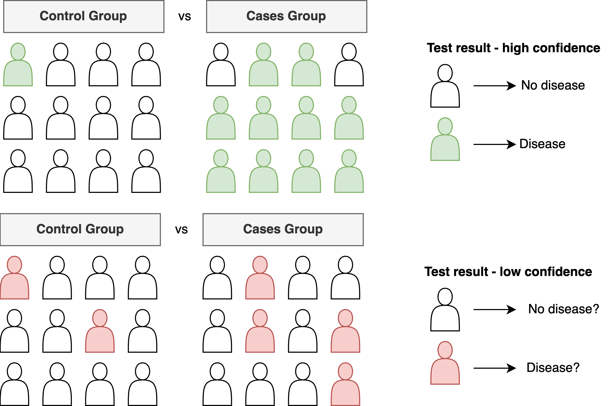
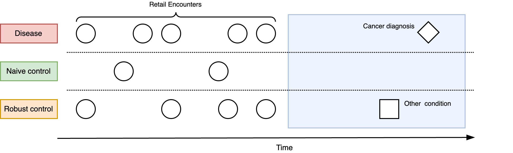

The early detection of diseases is a highly desirable approach for addressing conditions where late stage disease cannot be easily treated or managed. Through early  detection, it may be possible to take actions to minimise future disease severity or even prevent disease occurrence altogether. However, while the general concept is readily accepted, putting early detection into practice is often far from straightforward.

In this post, I will outline some ideas that can underpin a conceptual framework for developing early detection markers and point out some common mistakes. This is intended to provide a non-technical guide to some principles that might stimulate suitable study designs in the future.

## Disease progression

First, I will introduce some terminology to make this discussion clearer. There will be frequent use of the phrase *disease progression* to describe how a condition begins and typically worsens over time. I will also use the term *disease state* to refer to the severity of a condition at any one moment in time. Therefore, as a disease progresses, the disease state changes. I will often refer to four different phases of disease progression:

1. **Pre-disease** which describes the period before the onset of the condition.
2. **Early stage** disease which covers the period between the onset of the disease and the earliest signs that the condition may have started to manifest. 
3. **Established** disease typically describing the period when patients would likely be first diagnosed after clear symptoms have appeared and treatment is necessary.
4. Finally, **late stage** disease which occurs after the disease has evolved and new courses of treatments are required. The long-term quality of life for the patient maybe severely diminished.

The type of diseases that we will be thinking about are chronic conditions (e.g. dementia) or disorders such as cancer. Short-term conditions are not part of this discussion.

## Detecting disease

Identifying a disease requires the ability to measure some quantity, known as a **marker**, which is related to the disease state. The marker can be directly related to the disease, e.g. the size of a tumour on a CT scan, or an indirect marker such as an assessment of cognitive abilities in individuals with dementia. Markers that can directly measure disease state are preferred but indirect measurements may be the only pragmatic option in many situations.

The **detection window** refers to the period when the magnitude of the marker exceeds a threshold and it is possible to detect the presence (or absence) of the marker (i.e. the minimum size of a breast tumour that can be seen on a mammogram). The detection window should be as wide as possible to give the best chance of picking up the disease. For early detection, it is necessary for the detection window to overlap with the early onset of the disease and the **opportunity window** which is the period during which it maybe possible to intervene and influence the course of the disease progression (ideally, prevent it).

<figure>
    
    <figcaption>Figure 1. An illustration of the terminology used in this article with the four phases of disease progression and the ideal placing of the opportunity and detection windows to enable early detection of disease.</figcaption>
</figure>

## Types of early detection markers

In terms of their potential for early detection, disease markers can broadly be classified into one of two forms (i) progressive and (ii) transient markers. 

**Progressive markers** track the progression of the disease from early-onset to late-stage (Figure 1). They increase (or decrease) over time with the severity of the condition and do not ordinarily improve unless there is some medical intervention. The detection window opens as soon as the markers exceeds a certain threshold and does not close. For early detection, progressive markers should reach the detection threshold during the early phases of the disease giving the largest detection window possible.

<figure>
    
    <figcaption>Figure 2. Progressive markers gradually increase as the disease worsens, activating early during disease progression to give a large detection window that maximises the chance of overlapping with the opportunity window.</figcaption>
</figure>

**Transient markers** are linked to features of the disease that are only active during certain periods of disease progression. The detection window is therefore bounded by both the period in which the marker is active and the detection threshold. As with progressive markers, the detection window for a transient marker ideally occupies an early phase of disease and overlaps the opportunity window.

<figure>
    
    <figcaption>Figure 3. An ideal transient marker activates at an early disease stage and during the opportunity window.</figcaption>
</figure>

## Common mistakes

### Not all valid markers are "early detection markers"

When developing a marker for early detection it is absolutely *crucial* to understand the corresponding detection window and its relation to the opportunity window. For progressive markers, if the detection window does not overlap with early disease on-set and/or the opportunity window, the progression marker cannot be used to prompt early intervention. This can occur if the detection threshold is too high or the marker signal does not activate until the disease is well-established.

<figure>
    
    <figcaption>Figure 4. Examples of unsuitable progressive markers for early detection. Top: the detection threshold is too high and the disease cannot be determined before the opportunity window ends. Bottom: The markers does not switch on until the opportunity window ends.</figcaption>
</figure>

If a transient marker is only active fleetingly this may leave an impractically short opportunity window which is not large enough to realistically catch patients at that critical moment of their disease progression. 

<figure>
    
    <figcaption>Figure 5. Unsuitable transient markers for early detection.</figcaption>
</figure>

Many investigations of early detection markers often fail to acknowledge that not all valid progressive or transient markers are suitable for early detection and characterising these properly can reduce wasted effort later on.

### Case-control discovery

A frequently used approach to identifying early detection markers is to compare a group of individuals with late stage disease (cases) and to those with early stage disease (controls). Markers that differ between the groups are then candidate early detection markers. However, this approach is *limited*, since without any individuals occupying the intermediate stages of disease progression it is not possible to determine the detection window associated with the marker. The case-control study only tells us that the markers begin low in one group, and are high in the other. It does not tell us how quickly the marker reaches the detection threshold and therefore what the detection window is.

<figure>
    
    <figcaption>Figure 6. Early and late-stage patient comparisons can yield potential progressive markers but the full dynamic behaviour of the markers cannot be revealed without information from additional individuals occupying the intermediate stage of disease progression.</figcaption>
</figure>

Therefore the use of case-control type studies to identify early detection markers must be followed by validation studies to examine the dynamics of the potential markers to confirm and characterise their detection windows relative to the opportunity window.

### Association is not prediction

Another issue with case-control studies is that some investigations often confuse association with prediction. Association in these instances means that there are markers which are more (or less) likely to occur in the case population than in the control population. For example, there may be 40 in 1,000 late stage disease individuals who have a high-level of a blood protein marker, but only 5 in 1,000 early-stage individuals. We can then hypothesise that there may be an *association* of this marker with late-stage disease. It is tempting to extrapolate to this meaning that this is candidate early disease marker but extreme caution must be exercised. 

<figure>
    
    <figcaption>Figure 7. The green marker is present in most cases but hardly in any controls. A test based on this marker would give you high confidence about its results. The pink marker is associated with more cases than controls but if used as a basis for a test, our confidence in the results would not be very high.</figcaption>
</figure>

First, what are the absolute numbers? Does the marker appear sufficiently often enough in the disease population to actually be practically useful? In this example, most individuals did not have the marker present. Can we narrow down those members of the population where the marker is more likely to be present? This might require a further study. Second, what is the predictive value of the marker? As described before, the case-control study highlights differences between your two groups of individuals but it does not tell you how the marker behaves in any individual over time.

### Choosing an appropriate comparator

Many investigations of early disease markers often use a seemingly obvious control group - individuals with no or early stage disease - but this may not be appropriate. For example, suppose we are examining whether changes in an individual's retail spending patterns (e.g. store or credit card history) can be used to predict future cancer occurrence. It is reasonable to hypothesise that individuals with cancer could have exhibited early symptoms that led to more frequent purchases of off-the-shelf medications and health related products (e.g. pain relief, constipation relief, natural remedies). We might then wish to compare spend patterns between those with and without a cancer diagnosis. If a pattern exists, this signal could be exploited for early detection.

<figure>
    
    <figcaption>Figure 8. The frequency of retail encounters from store card record could be tested for their predictive utility of future cancer diagnosis. Comparisons can be made as a naive control consisting of individuals who do not have cancer but also a robust control set containing individuals who have other conditions.</figcaption>
</figure>

However, this approach excludes the possibility that changes in spending patterns could be induced by other, non-cancer conditions. While the spending pattern could clearly discriminate between those with and without cancer, is it specific enough to differentiate those who have cancer from someone who has a chronic but non-serious condition (such as irritable bowel syndrome)? Choosing the right comparator is important for determining the real-world utility of the putative early detection marker. In this example, a spending pattern which is induced by cancer but is not specific to cancer has limited utility due to the number of false alarms it could cause. 

## Discussion

The early detection of disease is a highly appealing and potentially extremely impactful. In this post I tried to describe aspects of how I think about the problem and discussed some conceptual ideas for developing early detection approaches. Some of these ideas seem quite obvious, yet surprisingly a number of studies fall foul of them nonetheless. Grappling with these concepts (and more that I did not have time to elaborate on) is critical to conducting effective research and development of early detection technologies, minimise wastage and ensuring resources are only focused on the most sound ideas. 

## Acknowledgements

Thanks to Dona Reddiar, Kieran Campbell, Max Little, David Wong and Anthony Chan for reading early drafts of this text.

